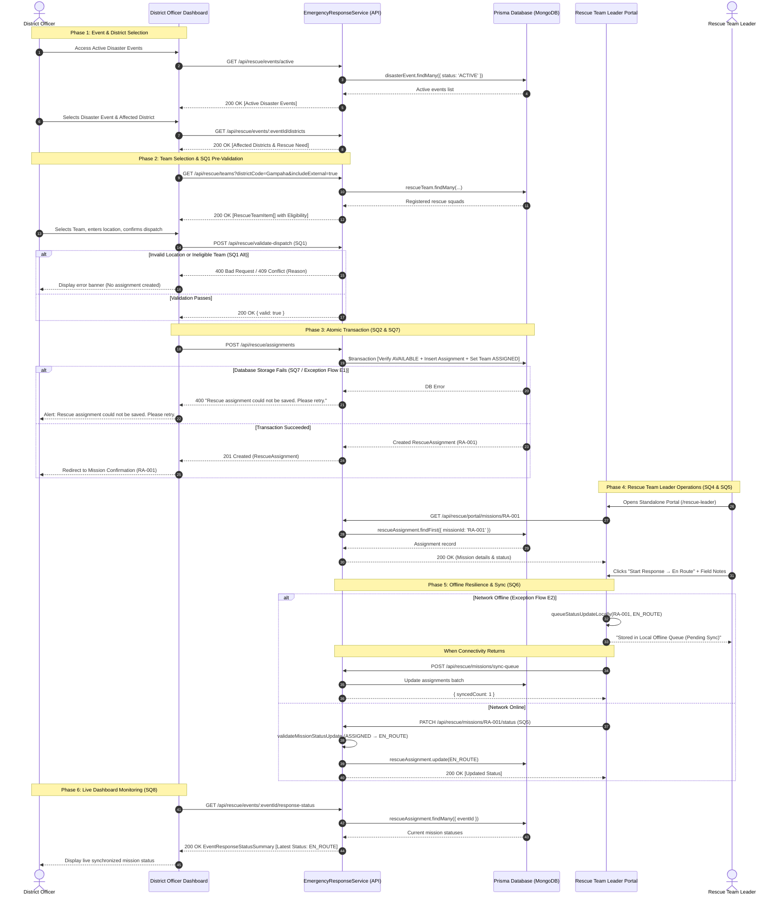

# Rescue Team Emergency Dispatch & Leader Operations
## Architecture, Sequence Flow (SQ1–SQ8) & API Specification Plan

---

## 1. Executive Summary & Use Case Scenario

### 1.1 Use Case Summary
**Use Case Name:** Dispatch Rescue Team During Emergency  
**Primary Actor:** District Officer (District Operations Console)  
**Supporting Actor:** Rescue Team Leader (Field Rescue Portal)  

### 1.2 System Objectives
1. Provide the **District Officer** with visibility over active disaster events, affected district severity levels, and real-time team availability.
2. Enforce pre-dispatch validation (**SQ1**) to guarantee only active events, valid geographic locations, and authorized cross-district squads are dispatched.
3. Guarantee atomic database operations (**SQ2** & **SQ7**) to prevent double-booking conflicts and partial state corruptions.
4. Support full alternative workflows (**SQ3**) when local teams are unavailable (cross-district deployment or clean exit).
5. Provide a standalone, dedicated **Rescue Team Leader Portal** (**SQ4** & **SQ5**) decoupled from the District Officer console with authorized status transitions.
6. Provide resilient offline storage queue and automatic sync (**SQ6**) for field squads operating in connectivity-challenged disaster zones.
7. Provide live status monitoring and synchronization polling (**SQ8**) back to the District Officer.

---

## 2. Sequence Design Requirements (SQ1 – SQ8)

| Ref | Sequence Requirement | Architectural Implementation |
| :--- | :--- | :--- |
| **SQ1** | **Pre-Dispatch Validation** | Added `EmergencyResponseService.validateDispatch(eventId, districtId, teamId, emergencyLocation)`. Validates event is active, location string is valid (>2 chars), and team eligibility. Returns 400/409 errors without writing to DB. |
| **SQ2** | **Atomic Persistence** | Replaced separate availability checks and status updates with `createAssignmentAtomically()`. Executes `$transaction` boundary: verifies availability &rarr; creates assignment record &rarr; updates team status to `ASSIGNED`. |
| **SQ3** | **Extended Alternate Flow A2** | UI provides: (1) Toggle for external/cross-district teams, (2) "Select Another District" action, (3) "Cancel & End Use Case" without assignment creation. |
| **SQ4** | **Dedicated Leader Portal** | Decoupled from District Officer Dashboard. Standalone routes at `/rescue-leader` and `/rescue/portal` with direct mission view `viewAssignedMission(assignmentId)`. |
| **SQ5** | **Mission State Authorization** | Added `validateMissionStatusUpdate(assignmentId, leaderId, newStatus)`. Enforces strict state sequence: `ASSIGNED` &rarr; `EN_ROUTE` &rarr; `ON_SCENE` &rarr; `COMPLETED` (or `CANCELLED`). |
| **SQ6** | **Local Offline Queue & Sync** | Added `Local Pending Status Queue` (`localStorage`). Queues updates when offline (`PENDING_OFFLINE`). `syncPendingStatusUpdates()` flushes queue when reconnected. |
| **SQ7** | **Exception Flow E1 (Rollback)** | In case of database failure, transaction is rolled back completely. Returns error message: *"Rescue assignment could not be saved. Please retry."* |
| **SQ8** | **Live Polling & Synchronized Dashboard** | Added `GET /api/rescue/events/:eventId/response-status` allowing District Officer dashboard to continuously retrieve latest synchronized mission statuses. |

---

## 3. End-to-End Sequence Diagram



---

## 4. REST API Specification

### 4.1 Dispatch & Event Operations

#### `GET /api/rescue/events/active`
- **Description**: Returns active disaster events requiring emergency operations.
- **Headers**: `x-officer-key: <KEY>`
- **Response (200 OK)**:
```json
[
  {
    "id": "EV-2026-FLOOD-01",
    "eventId": "EV-2026-FLOOD-01",
    "name": "Flood Warning",
    "hazardType": "FLOOD",
    "badge": "Escalated",
    "affectedDistrictsCount": 3,
    "warningLevel": "HIGH",
    "responseAction": "Rescue deployment required",
    "updatedAt": "2026-10-09T08:00:00.000Z"
  }
]
```

---

#### `GET /api/rescue/events/:eventId/districts`
- **Description**: Retrieves affected districts and rescue needs for the disaster event.
- **Parameters**: `eventId` (string)
- **Response (200 OK)**:
```json
{
  "event": {
    "id": "EV-2026-FLOOD-01",
    "name": "Flood Warning",
    "warningLevel": "HIGH"
  },
  "districts": [
    {
      "districtCode": "Gampaha",
      "districtName": "Gampaha",
      "warningLevel": "HIGH",
      "responseStatus": "Escalated",
      "rescueNeed": "Deployment required",
      "selected": true
    }
  ]
}
```

---

#### `GET /api/rescue/teams`
- **Description**: Lists registered rescue teams with optional district filtering and cross-district support.
- **Query Parameters**:
  - `districtCode` (string, optional)
  - `includeExternal` (boolean, optional)
- **Response (200 OK)**:
```json
[
  {
    "id": "67064d8a1c9d2f0012ab0001",
    "teamCode": "TEAM-A",
    "name": "Team A",
    "organization": "DMC",
    "districtCode": "Gampaha",
    "districtName": "Gampaha",
    "currentStatus": "AVAILABLE",
    "eligibility": "ELIGIBLE",
    "allowsCrossDistrict": false,
    "contactNumber": "+94 77 123 4567",
    "leaderName": "Capt. Nimal Perera"
  },
  {
    "id": "67064d8a1c9d2f0012ab0003",
    "teamCode": "TEAM-C",
    "name": "Team C",
    "organization": "NGO",
    "districtCode": "Colombo",
    "districtName": "Colombo",
    "currentStatus": "AVAILABLE",
    "eligibility": "CROSS_DISTRICT_ALLOWED",
    "allowsCrossDistrict": true,
    "contactNumber": "+94 76 555 1212",
    "leaderName": "Sarah De Silva"
  }
]
```

---

#### `POST /api/rescue/validate-dispatch` (SQ1)
- **Description**: Explicitly pre-validates deployment parameters before creating an assignment.
- **Request Body**:
```json
{
  "disasterEventId": "EV-2026-FLOOD-01",
  "districtCode": "Gampaha",
  "rescueTeamId": "TEAM-A",
  "emergencyLocation": "Riverside Area, Gampaha"
}
```
- **Responses**:
  - `200 OK`: `{ "valid": true, "eventId": "...", "districtCode": "Gampaha", "rescueTeamId": "...", "emergencyLocation": "..." }`
  - `400 Bad Request`: Location is invalid / team unauthorized for cross-district.
  - `409 Conflict`: Selected team is already `ASSIGNED`.

---

#### `POST /api/rescue/assignments` (SQ2 & SQ7)
- **Description**: Atomically creates a rescue assignment record and updates team status to `ASSIGNED`.
- **Request Body**:
```json
{
  "disasterEventId": "EV-2026-FLOOD-01",
  "districtCode": "Gampaha",
  "rescueTeamId": "TEAM-A",
  "emergencyLocation": "Riverside Area, Gampaha",
  "assignedBy": "Duty Officer"
}
```
- **Responses**:
  - `201 Created`:
```json
{
  "id": "67064d9b1c9d2f0012ab0010",
  "missionId": "RA-001",
  "disasterEventId": "EV-2026-FLOOD-01",
  "disasterEventName": "Flood Warning",
  "districtCode": "Gampaha",
  "districtName": "Gampaha",
  "rescueTeamId": "67064d8a1c9d2f0012ab0001",
  "rescueTeamName": "Team A",
  "organization": "DMC",
  "emergencyLocation": "Riverside Area, Gampaha",
  "assignedBy": "Duty Officer",
  "status": "ASSIGNED",
  "assignedAt": "2026-10-09T08:30:00.000Z",
  "updatedAt": "2026-10-09T08:30:00.000Z",
  "syncStatus": "SYNCHRONIZED"
}
```
  - `400 Bad Request`: `"Rescue assignment could not be saved. Please retry."` (SQ7)
  - `409 Conflict`: Team is no longer available.

---

### 4.2 Rescue Team Leader Operations (SQ4, SQ5, SQ6)

#### `GET /api/rescue/portal/missions/:id`
- **Description**: Retrieves assigned mission details for the Rescue Team Leader.
- **Headers**: `x-leader-id: leader-squad-1`
- **Response (200 OK)**: Returns `RescueAssignment` object with full emergency telemetry.

---

#### `PATCH /api/rescue/missions/:id/status` (SQ5)
- **Description**: Validates and updates mission lifecycle state.
- **Request Body**:
```json
{
  "status": "EN_ROUTE",
  "notes": "Squad departed base with boat equipment",
  "leaderId": "leader-squad-1"
}
```
- **Allowable Transitions**:
  - `ASSIGNED` &rarr; `EN_ROUTE` or `CANCELLED`
  - `EN_ROUTE` &rarr; `ON_SCENE` or `CANCELLED`
  - `ON_SCENE` &rarr; `COMPLETED` or `CANCELLED`

---

#### `POST /api/rescue/missions/sync-queue` (SQ6)
- **Description**: Flushes offline status queue stored on field device.
- **Request Body**:
```json
{
  "updates": [
    {
      "assignmentId": "RA-001",
      "status": "EN_ROUTE",
      "notes": "Departed base (queued offline)",
      "leaderId": "leader-squad-1",
      "timestamp": "2026-10-09T08:35:00.000Z"
    }
  ]
}
```
- **Response (200 OK)**: `{ "syncedCount": 1, "failedCount": 0 }`

---

#### `GET /api/rescue/events/:eventId/response-status` (SQ8)
- **Description**: Retrieves live response status and mission synchronization states for dashboard polling.
- **Response (200 OK)**:
```json
{
  "eventId": "EV-2026-FLOOD-01",
  "eventName": "Flood Warning",
  "totalAssignments": 1,
  "activeDeployments": 1,
  "missions": [
    {
      "id": "67064d9b1c9d2f0012ab0010",
      "missionId": "RA-001",
      "rescueTeamName": "Team A",
      "status": "EN_ROUTE",
      "emergencyLocation": "Riverside Area, Gampaha",
      "updatedAt": "2026-10-09T08:35:00.000Z",
      "syncStatus": "SYNCHRONIZED"
    }
  ],
  "lastSynchronizedAt": "2026-10-09T08:35:05.000Z"
}
```

---

## 5. Database Schema & Data Models

### 5.1 Prisma Models (`apps/api/prisma/schema.prisma`)

```prisma
enum RescueTeamStatus {
  AVAILABLE
  ASSIGNED
  UNAVAILABLE
}

enum MissionStatus {
  ASSIGNED
  EN_ROUTE
  ON_SCENE
  COMPLETED
  CANCELLED
}

model RescueTeam {
  id                  String           @id @default(auto()) @map("_id") @db.ObjectId
  teamCode            String           @unique
  name                String
  organization        String
  districtCode        String
  status              RescueTeamStatus @default(AVAILABLE)
  allowsCrossDistrict Boolean          @default(false)
  contactNumber       String?
  leaderName          String?
  createdAt           DateTime         @default(now())
  updatedAt           DateTime         @updatedAt

  @@index([districtCode, status])
  @@map("rescue_teams")
}

model RescueAssignment {
  id                String        @id @default(auto()) @map("_id") @db.ObjectId
  missionId         String        @unique
  disasterEventId   String        @db.ObjectId
  disasterEventName String
  districtCode      String
  districtName      String
  rescueTeamId      String        @db.ObjectId
  rescueTeamName    String
  organization      String
  emergencyLocation String
  assignedBy        String        @default("Duty Officer")
  status            MissionStatus @default(ASSIGNED)
  assignedAt        DateTime      @default(now())
  updatedAt         DateTime      @updatedAt
  notes             String?

  @@index([disasterEventId, districtCode])
  @@index([rescueTeamId, status])
  @@map("rescue_assignments")
}
```

---

## 6. Frontend Page Structure & URLs

| Role | Route URL | Purpose |
| :--- | :--- | :--- |
| **District Officer** | `/district/dashboard` | Main operational dashboard with quick-access tiles |
| **District Officer** | `/district/events` | Active disaster hazards list |
| **District Officer** | `/district/events/:id/districts` | Affected districts severity & rescue requirement |
| **District Officer** | `/district/events/:id/districts/:code/teams` | Available rescue teams with cross-district filter |
| **District Officer** | `/district/assign` | Assignment creation form with SQ1 validation |
| **District Officer** | `/district/missions/:id` | Live monitoring of assigned mission |
| **District Officer** | `/district/operations` | Overview of all active deployments and teams |
| **Rescue Team Leader** | **`/rescue-leader`** | **Dedicated Standalone Leader Interface** |
| **Rescue Team Leader** | **`/rescue-leader/missions/:id`** | **Direct Mission View with Offline Queue Sync** |

---

## 7. Verification & Test Suite

- **Type Check**: `bun run check-types` passed with 0 errors across `@repo/types`, `api`, and `web`.
- **Backend Unit Tests (`apps/api`)**: `vitest run rescue` &rarr; 13/13 passing tests.
- **Frontend Unit Tests (`apps/web`)**: `vitest run rescue` &rarr; 11/11 passing tests.
